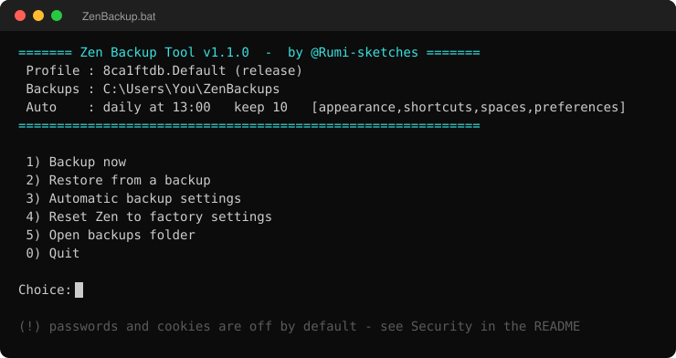

# Zen Backup Tool

Made by [@Rumi-sketches](https://github.com/Rumi-sketches).

A small Windows tool that backs up and restores your [Zen Browser](https://zen-browser.app) setup: themes, mods, custom CSS, toolbar and icon layout, keyboard shortcuts, workspaces (Spaces), and optionally your history, passwords, cookies, sessions and extensions.

It runs from a simple menu. You pick what to back up, how often, and how many copies to keep. Everything is driven by one settings file (`config.json`), so you never have to touch the scripts.




## Download

**[Download the latest version (zip)](https://github.com/Rumi-sketches/Zen-Auto-Backup-Tool/archive/refs/heads/main.zip)**

Then:

1. Extract the zip anywhere you like (for example your Desktop).
2. Open the folder and double click `ZenBackup.bat`.

That is it. No installer. Tagged versions are also on the [Releases](https://github.com/Rumi-sketches/Zen-Auto-Backup-Tool/releases) page.

## Why this exists

Uninstalling Zen does not remove your profile, and reinstalling brings everything back. That is great until you actually want a clean start, reinstalling Windows or even changing PCs, but still keep your look and your Spaces. Unfortunately Zen and Firefox do not give you a full backup option, but this tool lets you save the parts you care about and put them back on a fresh profile, without copying files by hand and running into the usual problems (broken absolute paths in `prefs.js`, blank toolbar icons, a leftover `user.js` that stops your settings from saving).

## Requirements

- Windows 10 or 11
- Zen Browser installed at least once (so a profile exists)
- PowerShell 5.1, which ships with Windows

No installation, no dependencies. Just the files in this folder.

## Getting started

1. Download or clone this folder anywhere you like.
2. Double click `ZenBackup.bat`.
3. The menu opens. On the first run it creates `config.json` with sensible defaults.

From the menu you can:

- **Backup now**: full, or only the categories you choose.
- **Restore from a backup**: pick a backup, then pick which categories to bring back.
- **Automatic backup settings**: frequency, how many copies to keep, which categories, where to store them.
- **Reset Zen to factory settings**: offers a safety backup, removes Zen's data folders, then lets you reopen Zen as a fresh install or go straight into a restore. Zen itself stays installed.

If you prefer the command line, the same actions live in the `lib` folder:

```
powershell -File lib\backup.ps1            # backup using your saved settings
powershell -File lib\backup.ps1 -Categories appearance,spaces
powershell -File lib\restore.ps1           # interactive restore
powershell -File lib\reset.ps1             # safety backup, then factory reset
```

## Settings

All settings live in `config.json`. You can edit them from the menu or by hand.

| Setting | Meaning |
|---|---|
| `backupFolder` | Where the `.zip` backups are stored. Supports variables like `%USERPROFILE%`. |
| `keep` | How many backups to keep. Older ones are deleted automatically. |
| `categories` | What the automatic backup includes (see the table below). |
| `schedule.frequency` | `daily`, `hourly`, `weekly`, `onlogon`, or `disabled`. |
| `schedule.time` | Time of day for `daily` and `weekly`, as `HH:mm`. |
| `schedule.everyHours` | Interval for `hourly`. |
| `schedule.weekday` | Day for `weekly` (`MON` to `SUN`). |
| `profileOverride` | Folder name of a specific profile. Leave empty to auto detect the active one. |

The automatic backup is a Windows scheduled task named `ZenBackup`. The menu creates and updates it for you when you change the frequency.

## Categories

| Category | What it covers | Default |
|---|---|---|
| `appearance` | UI, custom CSS, mods, themes, toolbar and icon layout | on |
| `shortcuts` | Keyboard shortcuts | on |
| `spaces` | Workspaces: names, themes, tabs, essentials, containers, tab notes | on |
| `preferences` | `prefs.js`, with path and SVG icon fixes applied on restore | on |
| `history` | History and bookmarks | on |
| `sessions` | Open tabs and windows | on |
| `extensions` | Installed extensions | on |
| `passwords` **(!)** | Saved passwords | **off** |
| `cookies` **(!)** | Cookies and site permissions | **off** |

**(!)** marks credentials. See [Security](#security) before turning them on.

## Restoring onto a fresh install

1. Open Zen once so it creates a profile, then close it completely.
   - Coming from an old configuration? Use option 4, "Reset Zen to factory settings", and pick "Open Zen, then restore a backup" at the end: it opens Zen, waits for the new profile, waits for you to close Zen, and starts the restore by itself.
2. Otherwise run the tool and choose **Restore**.
3. Pick your backup, then pick the categories you want. For just your look and your Spaces, choose `appearance`, `shortcuts`, `spaces` and `preferences`.

Zen must be closed during a restore. The tool checks this and stops if Zen is still running.

## Security

**Backups are plain, unencrypted zip files.** That is a deliberate trade-off: no password to lose, no proprietary format, and you can always open a backup by hand. It also means the archive is only as safe as the folder it sits in.

Two categories are credentials and are therefore **off by default**:

| Category | Files | What an attacker gets |
|---|---|---|
| `passwords` | `key4.db`, `logins.json`, `logins-backup.json` | Every password saved in Zen, decryptable offline unless you use a Primary Password |
| `cookies` | `cookies.sqlite`, `permissions.sqlite` | Session cookies: your logged-in sessions, reusable without your password |

`sessions` is on by default and is milder, but `sessionstore.jsonlz4` still holds the live state of your open tabs.

If you turn the credential categories on, the tool marks them `(!)`, warns you before every interactive backup, and highlights them in the menu header when they are part of the automatic schedule. On top of that:

- Keep the backups folder on a drive only you can read. Avoid shared folders, USB sticks and cloud sync (OneDrive, Dropbox, Google Drive).
- Set a **Primary Password** in Zen. Without it, `key4.db` and `logins.json` are enough to recover your passwords on any machine.
- Deleting a backup zip does not shred it. On an SSD, treat a leaked backup as leaked for good and change the passwords that mattered.

The tool never uploads anything. Everything stays on your machine, and there is no telemetry.

## Logs

Every automatic backup writes a line to `zenbackup.log` in the backups folder, next to the zips. The scheduled task runs with no window, so this is where you find out that last night's backup failed because the profile moved or the disk was full. Only the most recent 200 lines are kept.

## How Spaces are stored

This was trivial to understand. All of your workspace definitions (names, colors, order, tabs, essentials) live in a single file, `zen-sessions.jsonlz4`, under its `spaces` key. They are not in `places.sqlite`. The `spaces` category backs up that file, so restoring `spaces` is enough to get your workspaces back. You do not need `history`.

## What it can and cannot do

It can:

- Back up and restore your Zen look, shortcuts, workspaces, and data, all or in part.
- Run automatically on a schedule and keep a fixed number of copies.
- Restore onto a brand new profile, fixing the absolute paths in `prefs.js` and the blank toolbar icons that usually break a manual copy.
- Move your setup to another Windows machine by copying a backup `.zip` across.

It cannot:

- Sync in real time. It takes snapshots, it is not a live sync service.
- Guarantee a perfect copy of databases (history, cookies, passwords) while Zen is open. SQLite keeps recent changes in a side file, so for those categories close Zen first or run the backup at a time when it is closed. Workspace and appearance files are written atomically and are always safe.
- Work on macOS or Linux (I did not have a macOS or Linux device to test). The paths and the scheduler are Windows only. The backup format itself is just a zip of profile files, so the data is portable even if the scripts are not.
- Merge two profiles. A restore overwrites the selected files in the target profile.

## Notes

- Your profile folder name has a random prefix (for example `xygu6nr4.Default (release)`) that changes every time you reinstall Zen. The tool auto detects the active profile, so this is handled for you.
- Backups are plain zip files. You can open one and pull out a single file if you ever need to. Read [Security](#security) for what that implies.
- Version history is in [CHANGELOG.md](CHANGELOG.md).
- This project is not affiliated with Zen Browser.

## Disclaimer

This is an open source project I built for my own needs and my own use. It comes with no warranty of any kind. I am not responsible if something goes wrong, if a backup or restore fails, or if your backups are lost. Always keep a separate copy of anything you cannot afford to lose, and test a restore before you rely on it.

## License

MIT. See [LICENSE](LICENSE).
